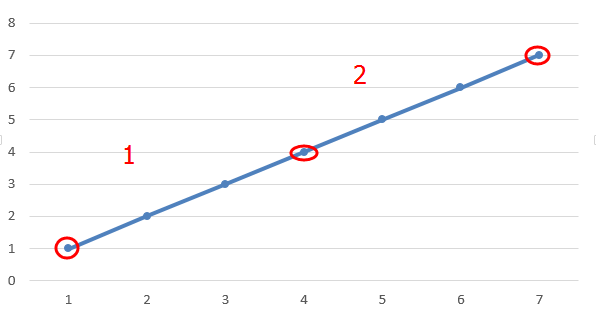
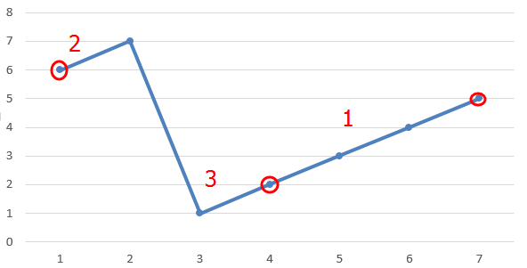
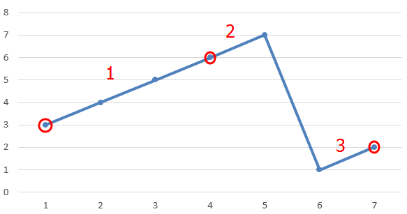

# Search in Rotated Sorted Array

Suppose an array sorted in ascending order is rotated at some pivot unknown to you beforehand.

(i.e., `[0,1,2,4,5,6,7]` might become `[4,5,6,7,0,1,2]`).

You are given a target value to search. If found in the array return its index, otherwise return `-1`.

You may assume no duplicate exists in the array.

Your algorithm's runtime complexity must be in the order of *O*(log *n*).

> **Example:**
>
> ```
> Input: nums = [4,5,6,7,0,1,2], target = 0
> Output: 4
>   
>   Input: nums = [4,5,6,7,0,1,2], target = 3
>   Output: -1
>   ```


**Idea:** (from [pezy](https://github.com/pezy/LeetCode/tree/master/032.%20Search%20in%20Rotated%20Sorted%20Array))

There are 3 scenarios: 







* Search success: `if (target == nums[m]) return m;`
* Moving left  `right = m - 1;`:
  * In scenario 1, target is in partition 1, `nums[left] <= target < nums[m]`
  * In scenario 2 , target is in partition 2/3, `nums[left] > nums[m] && (nums[left] <= target || nums[m] > target))`
  * In scenario 3, target is in partition 1, `nums[left] <= target < nums[m]`
* Moving right  `left = m + 1;`:
  * In scenario 1, target is in partition 1, `nums[m] < target <= nums[right]`
  * In scenario 2, target is in partition 1, `nums[left] <= target < nums[m]`
  * In scenario 3 , target is in partition 2/3, `nums[m] > nums[right] && (nums[m] < target || target <= nums[right]))`
* Other cases `return -1;`


Time complexity: O(log *n*)

Space complexity: O(1)


**Solution:** [C++](./solution.h)	[Test](./Test.cpp)